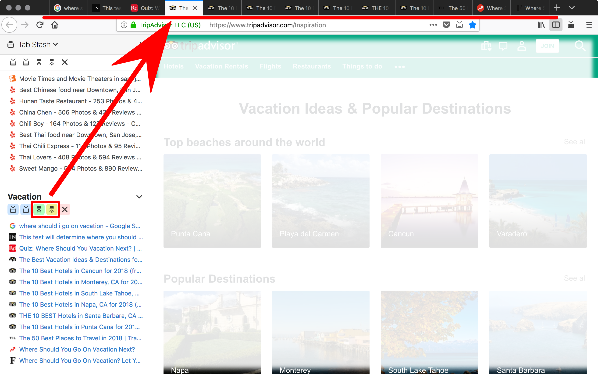

# Tab Stash

Can't keep all your open tabs straight?  Need to clear your plate, but want to
come back to your tabs later?

Tab Stash is a no-fuss way to save, restore and organize batches of tabs as
bookmarks.  With one click on the Tab Stash icon, you can sweep your browser
window clear of tabs, and save them all into the "Tab Stash" sidebar, organized
conveniently into groups.  Then, when it's time to go back to that research
project, just pop open the sidebar and restore the whole group, or restore only
that one tab you were interested in.

Because Tab Stash stores your tabs as bookmarks, they will even sync to your
other computers or mobile devices (using Firefox Sync, if configured).  You
don't need to keep track of yet another account, and no other cloud service can
see your tabs.



## Features

- Stash all your open tabs in one click (in browser toolbar)
- Stash individual tabs in one click (in address bar)
- Unobtrusive Firefox sidebar which shows all your stashed tabs
- Restore and delete entire groups of tabs, or individual tabs within a group
- Drag and drop stashed tabs and groups to re-organize them
- Rename tab groups, or keep the automatically-generated names
- Intelligent migration of duplicate tabs to the newest groups (for unnamed
  groups; tabs in named groups are not disturbed)

## Usage Tips

### Easy Access to the Sidebar

For easy access to the "Tab Stash" sidebar, we recommend you place Firefox's
"Sidebars" button in your toolbar.  If it's not already there, you can do this
by following these steps:

1. Right-click on the Firefox toolbar (anywhere outside the address bar).
2. Click "*Customize...*" from the popup menu.
3. Find the icon labeled "*Sidebars*", and drag it to your toolbar.  (If you
   don't see it, it's probably already in your toolbar somewhere.)

If you would prefer not to do this, you can always load the list of stashed tabs
by right-clicking anywhere on the page, selecting "*Tab Stash*" from the popup
menu, and choosing "*Show Stashed Tabs*".

### Keyboard Shortcuts

On **Mac**:

- Show stashed tabs in sidebar: *Ctrl+Shift+S*
- Stash all open tabs: *Ctrl+Shift+T*
- Stash the active tab: *Ctrl+Shift+W*

On **Windows**, **Linux** and other platforms:

- Show stashed tabs in sidebar: *Alt+S*
- Stash all open tabs: *Alt+T*
- Stash the active tab: *Alt+W*

### Alternate Ways to Manage Your Stash

To see all your stashed tabs as bookmarks, you can browse to the "*Tab Stash*"
folder in the Firefox bookmarks editor.  However, restoring a tab and opening a
bookmark are different--when restoring a tab through the *Tab Stash* sidebar,
Tab Stash will first search for a matching hidden or recently-closed tab.  If
there are no matching tabs, only then will Tab Stash open a new tab.

If you want to delete, move, or edit bookmarks saved by Tab Stash, you are free
to use the built-in Firefox bookmark editor, or any other bookmarks extension
you like.  Any hidden tabs associated with bookmarks that are deleted or moved
out of the stash will automatically be closed by Tab Stash to free up system
resources.

## Privacy

Tab Stash does not share any of your information with the developers, or with
any third party, except as noted below.

### Bookmarks and Firefox Sync

Tab Stash uses bookmarks to store all your stashed tabs.  Your bookmarks are
synced using the Firefox Sync service (if configured), so your stashed tabs will
appear on all computers linked to your Firefox Sync account.

If you wish to stop using Tab Stash entirely, you can still retrieve your
stashed tabs in the "Tab Stash" folder of your bookmarks.

### Site Icons and Google

Like many other extensions, Tab Stash shares the domain names of tabs that you
stash with Google, for the purpose of obtaining the site's icon.  If you are
already logged into Google, Google may be able to identify you using login
cookies sent as part of the request.  However, no other personally-identifying
information is shared, and the full URL of the tab is never disclosed.

### Extension Permissions

When you first install it, Tab Stash will ask for the following permissions.  Here's why we need each of them:

- **Access browser tabs**: Used to save and restore tabs to the stash.
  (Honestly, we'd all be surprised if an extension with a name like "Tab Stash"
  *didn't* have this permission.)

- **Access recently closed tabs**: When restoring a stashed tab, Tab Stash will
  look thru recently-closed tabs to see if any of them have matching URLs, and
  restore the closed tab rather than creating a new one.  This will restore
  additional state for that tab, such as navigation history.

- **Hide and show browser tabs**: Used to hide stashed tabs instead of closing
  them outright, so they can be restored more quickly later (and preserve useful
  tab state such as navigation history, or that half-written blog post about
  last night's dinner you were in the middle of when your boss walked by...).

- **Read and modify bookmarks**: Used to create and delete bookmarks in the "Tab
  Stash" folder which represent your stashed tabs.

- **Read and modify browser settings**: Read-only; used to determine the new-tab
  and Home pages, so Tab Stash can tell if you're looking at a new tab, and
  automatically close it if it's not needed.  Tab Stash does not modify your
  browser settings.  (Although, if we *did*, we'd probably change your homepage
  to be a picture of a kitten.  Because who doesn't like kittens?)

- **Menus**: Used to provide additional options for Tab Stash in the right-click
  menu of a page and the tab bar.

## Developer Corner

### Building Tab Stash for Development
```sh
$ npm i
$ npm run build
```

The result will be in the `dist` directory.  You can load it into your Firefox
by following these steps:

1. Go to `about:debugging`
2. Click "*Load Temporary Add-on*"
3. Browse to the `dist` directory, and select the `manifest.json` file.

### Building Tab Stash for Release

```sh
$ npm i
$ npm run pkg
```

The result will be a `tab-stash-X.Y.zip` file, which can be uploaded to
addons.mozilla.org.

### Editing Icons

We recommend [Inkscape](https://inkscape.org/en/).  Please be sure to follow the
Firefox [Photon Design Guide](https://design.firefox.com/photon/).
