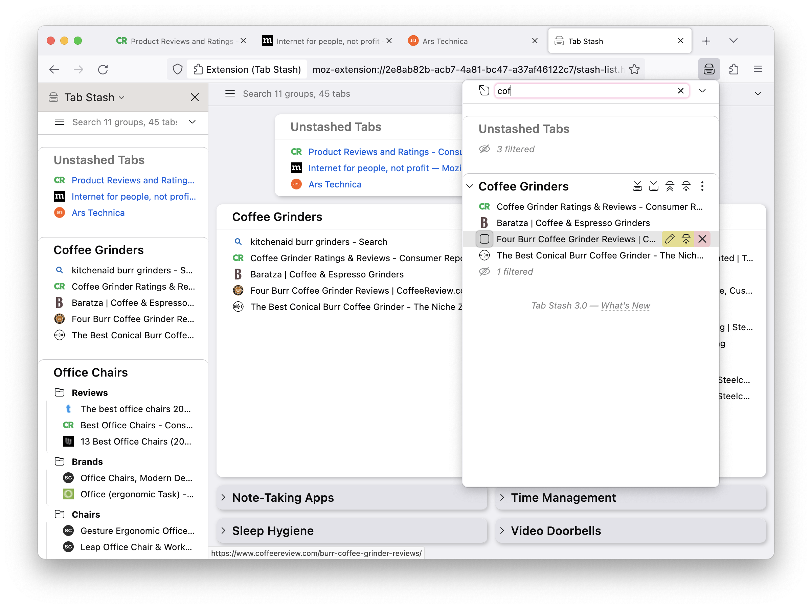

# Tab Stash

Can't keep all your open tabs straight?  Need to clear your plate, but want to
come back to your tabs later?

Tab Stash is a no-fuss way to save, restore and organize batches of tabs as
bookmarks.  Sweep your browser window clear of tabs with one click on the Tab
Stash icon, and save them all into the "Tab Stash" sidebar or tab, conveniently
organized into groups.  When it's time to go back to that research project, just
open your stash and restore the group, or restore only that one tab you were
interested in.

Because Tab Stash stores your tabs as bookmarks, they will even sync to your
other computers or mobile devices. Uses Firefox Sync, if configured---no need
to keep track of yet another account.

## Features

- Stash all your open tabs in one click (in browser toolbar)
- Stash individual tabs in one click (in address bar)
- Show all stashed tabs in an unobtrusive Firefox sidebar
- Show all stashed tabs in a full-browser tab view
- Search your stash by typing in the search box at the top of the sidebar/tab
- Restore and delete entire groups of tabs, or individual tabs within a group
- Drag and drop stashed tabs and groups to re-organize them
- Rename tab groups, or keep the automatically-generated names
- Import and export tabs in rich text, Markdown, OneTab and more (**NEW in 2.6**)

## Want to give it a try?

Install Tab Stash from [Mozilla Add-Ons][amo]!

[amo]: https://addons.mozilla.org/en-US/firefox/addon/tab-stash/
